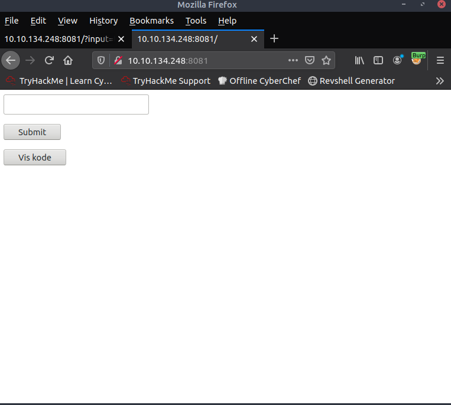

# NisseInput

Points: 200

> Kan du finde et input der opfylder nissebandittens betingelser?
> Opgaven kan tilgås her "tryhackme.com/jr/webopgaver2022". Start derefter maskinen og få tildelt dens IP-adresse. Opgaven kører på port 8081 f.eks. http://10.10.102.76:8081/.

## Walk through



Just an input field, a submit button and a 'show code'.  
Showing code gives us our favourite web language: php.

```php


test

Ingen adgang

<!DOCTYPE html>
<html lang="en">
<title></title>

<body>

<div id="phpbox1">
    <form method="get">
        <input type="text" name="input" required>
      <p><button type="submit">Submit</button></p>
    </form>
</div>


<?php
require 'flag.php';

if (isset($_GET['input'])) {
    
        $str = $_GET['input'];

    trim($str," ");
    $x = strlen($str);
    
    $p = preg_split('/[.|_|!]/', $str);
    $i = 0;
    while($i < count($p)) {
        $w = $p[$i];
        if ($w === "i") {
            
            $p[$i] = "Goddag";
        }
        if ($w === "Goddag") {
                        
                        $p[$i] = "nissestuen";
                }
        if ($w === "nissestuen") {
                        
                        $p[$i] = "i";
                }

        $i = $i + 1;
    }
    
    $s = implode("_", $p);
    $str = implode("_", explode("_", $s));    

    $str = $s;

     $tmp = "Goddag_i_nissestuen";
    $y = strlen($tmp);

    $m = fmod($x,$y);
    
    if(intval($m) === intval(0) )
 
    {
        $str = preg_replace("/\s+/", "", $str);
        
    }
    else {
        $str = str_replace("_", "-", $str);
    }


    $f = preg_replace("/Goddag-i-nissestuen/i", '', $str);
     
    if($f === $tmp) {
             DerErIkkeEtFlagHer();
     }

    else {
        echo "<p>" . $f . "</p>";
        echo "<p>Ingen adgang</p>";
    }
  
    
}
?>

<form method="post">
      <p><button type="submit" name="kode">Vis kode</button></p>
</form>


<?php

if(array_key_exists('kode', $_POST)) {
        button1();
}

function button1() {
        show_source("index.php");
}


?>


</body>
</html>

```

So, it is clearly a matter of figuring out how to structure a string, that matches what is stored in `$tmp`.  
The correct answer is: `i.nissestuen.Goddag` which gives the flag.

## Flag

`nc3{Du_fandt_et_nisseloejerligt_input}`