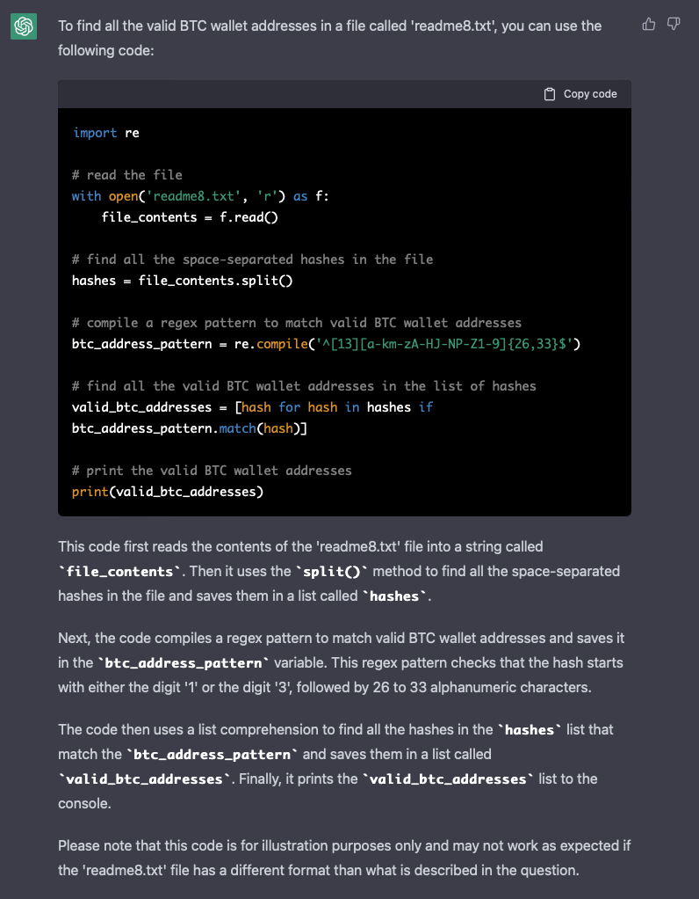

# Kryptonissen vs Drillenissen

Points: 200

> Kryptonisse vil donere nogle bitcoins til julemanden, men men men... Drillenisen har desværre gemt Julemandens bitcoin adressen i en lang tekstfil. Heldigvis er Kryptonisse ikke så let at snyde, han kan jo bare søge på udtrykket "1", da det er en af de mulige karakterer en bitcoin adresse starter med. Det var da nemt?
>
> Filen kan downloades her: tryhackme.com/jr/kryptonissenvsdrillenissen
>
> Flag = nc3{Bitcoin adresse}

## Walk through

So the [file](./readme8.txt) is full of hashes. A LOT of hashes.  
BTC wallet addresses have a specific format though, so we can at least validate if these hashes COULD be BTW wallets and pray only 1 fits the bill.

It is quite easy to find a regex that can do this is and simply parse the file BUT I am quite fascinated by chatGPT these days so let's try to ask that.  

Hah, it thinks I am bit out of line here.  
It still answers though 🤷

Code is in this [file](find.py).

So the flag is `nc3{1LQoWist8KkaUXSPKZHNvEyfrEkPHzSsCd}`