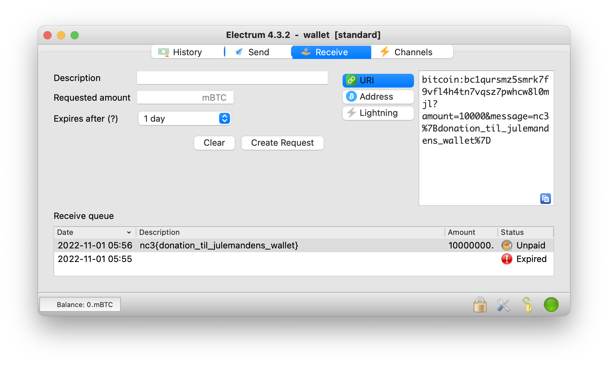

# Assignment
You are given a electrum wallet file, the wallet is password protected and you have lost both password and initial seed.

With the help of [rockyou.txt](https://github.com/brannondorsey/naive-hashcat/releases/download/data/rockyou.txt), [BTCRecover](https://btcrecover.readthedocs.io) and some patience, we are able to recover the password using:
```
$ python3 btcrecover.py --wallet-type ethereum --wallet wallet --passwordlist rockyou.txt
...
...
Password found: 'julemanden007'
```

Having found the password, the wallet can be opened using [Electrum](https://electrum.org/#download) and in **Receive** tab we find the flag.


# Flag
`nc3{donation_til_julemandens_wallet}`
